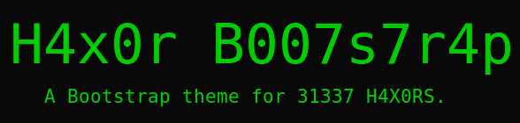

# tilde team hacker bootstrap theme

this is a fork of [brobin's hacker bootstrap](https://github.com/brobin/hacker-bootstrap)

the latest compiled css will be available [here](https://tilde.team/css/hacker.css)

the major changes from the original are a few tweaks to colors of code samples and font sizes.

feel free to use and modify as you like!


this is the style used on [tilde.team](https://tilde.team).



a bootstrap theme for 1337 h4x0rs. inspired by the classic green on black terminal style. this theme will make your website 1337.

check out the [example site](https://tilde.team/css/)!


## usage

you can pick up the latest [hacker.css](https://tilde.team/css/hacker.css) and reference the css in your page.

```html
<link href="https://tilde.team/css/hacker.css" rel="stylesheet">
```

**or** you could be a real h4x0r.

**h4x0rs only**

open up your h4x0r terminal and type the following:

```bash
git clone https://tildegit.org/team/site
cd site/css
```

if you want to make adjustments with live-reloading, try this:
```bash
make dev
```

if you just want to compile, you can do this:
```bash
make
```
you'll find the compiled css in hacker.css to do with as you please


## contributing

feel free to hack around and submit pull requests. not every style is 100% comp1337, so any assistance is greatly appreciated.

thanks for stopping by :)


## license

mit
